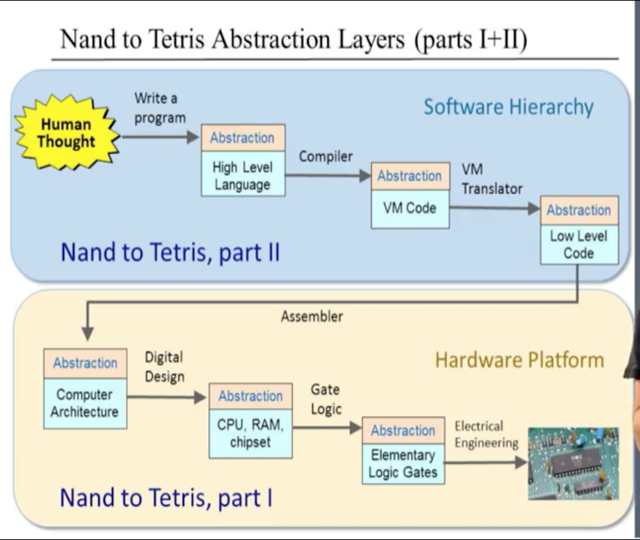

# Nand2Tetris
Projects of the Nand2Tetris course described in https://www.nand2tetris.org/course

## Summary of projects:
- 
#### Project 1: Boolean Logic
Built logic gates, like And, Not, Or, Xor, Dmux, and so on, sing primitive NAND gates and the composite gates gradually built on top of them
#### Project 2: Boolean Arithmetic
Built an ALU (Arithmetic Logic Unit) for the Hack computer, using all the gates of the previous projects and other combinational chips built upon them, like HalfAdder, FullAdder, Add16...
#### Project 3: Sequential Logic
Built a Program Counter and RAM units of different size (up to 16K), using Registers designed with primitive DFF gates and the chips constructed in the previous projects
#### Project 4: Machine Language
Wrote Assembly Language programs using the Hack Machine Language
#### Project 5: Computer Architecture
Completed the construction of the Hack CPU and the Hack hardware platform, leading up to the top-most Computer chip.
#### Project 6: Assembler
Wrote an Assembler program in Python that translates programs written in the symbolic Hack assembly language into binary code that can execute on the Hack hardware platform built in the previous projects
#### Project 7: VM I: Stack Arithmetic
Built a basic VM translator in Python, focusing on the implementation of the VM language's stack arithmetic and memory accesscommands. In Project 8, this basic translator will be extended into a full-scale VM translator.

